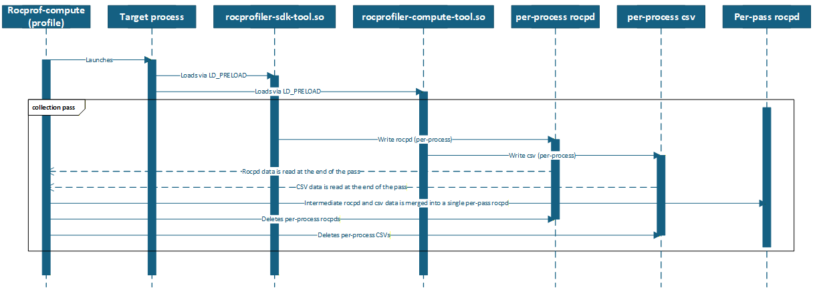
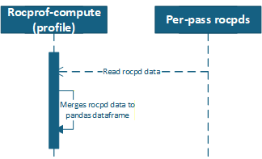
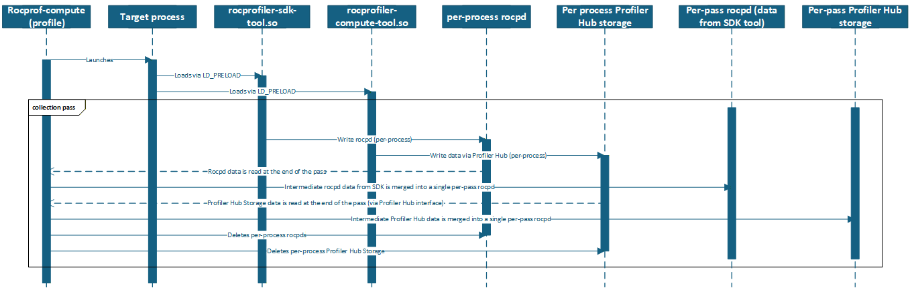
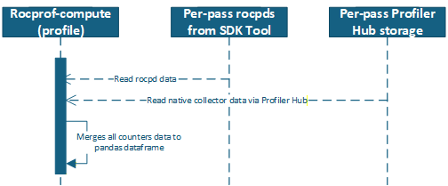

# Integration of Profiler Hub in rocprof-compute for profiling phase

## System context
[Profiler Hub](https://github.com/ROCm/rocm-systems/tree/develop/profilers/profiler-hub) is a data storage level which abstract profiling tools from concrete data format on disk.

Rocprof-compute produces two types of artifacts:
- Profiling data - raw unprocessed data from target application and system.
- Analysis data - processed data according to specific analysis type selected by user.

Profiler Hub is targeted to abstract both of these types of data. However, only profiling data is a focus of this HLD at the first step.

Profiling phase currently supports two output formats CSV and ROCPD. Currently CSV format is planned to be deprecated as part of another HLD (TODO: add link). **Therefore, scope of HLD is ROCPD data collection on profiling phase only.**

### Profiling phase
During profiling phase `ROCm Compute` loads two collectors via `LD_PRELOAD`:
- rocprofiler-sdk-tool.so - `ROCm SDK`-provided library which collects profiling data inside target process:
    - Collection result is in `rocpd` format containing kernel dispatches, agents info, kernel symbols.
    - Counters collection is disabled (when native collector is used, which is by default).
    - Separate databases are produced per each process and each run. Because many analysis types require ~10-20 passes and complex workloads could spawn multiple processes, this could produce ~100+ databases.
    - At the end of each collection pass individual databases are merged into a resulting database.
- rocprofiler-compute-tool.so - `ROCm Compute`-provided library which collects profiling data inside target process.
    - Collection result is in `csv` format containing hardware counters.
    - Collected data is accumulated in memory and is written on disk at the process end.
    - After each collection pass, the data from csv is merged into resulting database.

The following diagram illustrates the flow. Note that in real workloads there will be multiple processes and each process will do data writing independently from each other.

*Note: Currently `profile` phase converts the databases into CSV files but this step is to be removed as part of another effort. Therefore, in scope of this HLD this step is ignored.*

### Analysis phase
During analysis phase `ROCm Compute` loads merges all per-pass rocpd databases into a single Pandas dataframe in the memory. The merge is done by `Kernel Name + Grid Size` (default) or just `Kernel Name`.

*Note: Currently `analyze` phase loads CSVs (which are rocpd files are converted to on `profile` phase). But this step is to be removed soon. Therefore, in scope of this HLD this step is ignored and it's assumed that rocpd are read directly.*

## Problem statement
Multiple tools depend on rocpd format - ROCm SDK, ROCm Compute, ROCm Systems and ROCm Optiq. Therefore, this format is subject to change to meet the needs of all of these tools. In the current architecture such changes directly impact (potentially break) read/write logic for the rocpd. Therefore, it's important to abstract read/write operations by a more stable interface.

Additionally, we need a flexibility to support other formats in addition to rocpd. The primary motivation is to provide better size and performance characteristics compared to rocpd. For example, here are the current profiling data sizes across different frameworks:

| Framework               | Model                                    | Disk: complete profiling                                |
| ----------------------- | ---------------------------------------- | ------------------------------------------------------- |
| PyTorch (native)        | **GLM-4-9B**                             | ~50–120 GB (inference)                                  |
| PyTorch (native)        | **DeepSeek-V3** (optional)               | 1.4–1.5 TB (inference)                                  |
| JAX (Flax / jax-rocm)   | **Qwen3-8B** (Flax port or HF)           | 80–200 GB (training); 20–50 GB (inference)              |
| JAX (Flax / jax-rocm)   | **Llama 3.1 8B** (if Flax available)     | ~80–200 GB (training); ~25–60 GB (inference)            |
| Megatron (Primus/ROCm)  | **Llama 3.1 70B** (proxy ok)             | 1.5–3 TB (full 70B); 400–900 GB (proxy, short run)      |
| Megatron (Primus/ROCm)  | **DeepSeek-V3** (3-layer proxy)          | 4–6 TB (full); ~200–500 GB (3-layer proxy, short iters) |
| Megatron (Primus/ROCm)  | **Qwen2.5-7B**                           | 80–200 GB (short run)                                   |
| vLLM                    | **DeepSeek-V3**                          | 1.4–1.5 TB                                              |
| vLLM                    | **DeepSeek-R1**                          | 1.4–1.5 TB                                              |
| vLLM                    | **Qwen3-32B**                            | 70–170 GB                                               |
| vLLM                    | **Qwen3 Coder 480B** (optional)          | 1.0–1.1 TB                                              |
| SGLang                  | **DeepSeek-V3**                          | 1.4–1.5 TB                                              |
| SGLang                  | **Qwen3-32B**                            | 70–170 GB                                               |
| SGLang                  | **Qwen3 Coder** (e.g. 32B or 480B)       | 70–170 GB (32B); 1.0–1.1 TB (480B)                      |
| Hugging Face TGI        | **Qwen3-32B**                            | 70–170 GB                                               |
| Hugging Face TGI        | **GLM-4-9B** or **GLM-4.5-Air**          | 50–120 GB (9B); 220–310 GB (Air)                        |
| Hugging Face TGI        | **DeepSeek-V3** (optional)               | 1.4–1.5 TB                                              |
| Triton Inference Server | **Qwen3-32B** (if Triton + vLLM backend) | 70–170 GB                                               |

Such support for additional formats shall have a manageable maintenance cost and therefore read/write operations again need to be abstracted by an interface from the rest of the product code.

Profiler Hub interface serves exactly this purpose, therefore this HLD defines the target architecture which we want to achieve as a result of Profiler Hub integration.

## Requirements
- Profiler Hub shall abstract read write operations in native collector for profiling database in both `profile` and `analysis` phases of ROCm Compute.
- Design shall cover counters data and be extendable to PC Sampling data (including Source, ISA, instruction dependencies).
- Design shall allow easy swap of rocpd format to any other format (ex. Parquet). This means that ROCm Compute code shall not depend and know about a concrete format or file structure on the disk.
- Design shall cover counters data read/write on a first stage but be expandable for future data collected by native-collector, such as PC sampling.

## Design
### Profiling phase
The following architectural changes are to be made to switch counter collection in profiling phase onto Profiler Hub:
- `rocprofiler-compute-tool` collector creates Profiler Hub storage file and writes counters data into it. This file name shall include <pid> because real workloads will spawn multiple processes.
- `Profile` mode of `ROCm Compute` still merges per-process Profiler Hub storage files into a single file in scope of a single pass. However, it does it by using Profiler Hub interface as well in order to abstract this logic from concrete format on the disk. This is not a strong requirement and we may reconsider it if there are performance and implementation cost implications. But the reasoning for this requirement is convenience as it will reduce a number of resulting files by an order of magnitude.
- Data from `rocpd` and `Profiler Hub` produce separate artifacts and have separate processing code paths. This is because the long-term plan is to fully switch on rocprofiler-compute-tool for data collection and therefore on ProfilerHub for data read/write. Therefore, merge of `rocpd` and `Profiler Hub` data would introduce unnecessary coupling between these data formats which would increase the cost of aforementioned switch.

This design also means that rocprof-compute will need to implement python bindings for both read and write interfaces of Profiler Hub.

### Analysis phase
The following architectural changes are to be made to switch counter collection in analysis phase onto Profiler Hub:
- `Analysis` phase reads both per-pass Profiler Hub and rocpd data and merges them both into a single Pandas dataframe.

### Addition of PC Sampling data support in Profiler Hub
PC Sampling data collection is spread between both `rocprofiler-compute-tool` and `rocprofiler-sdk-tool`. However, the long-term plan is to move all this data collection to `rocprofiler-compute-tool` only. This work is currently in progress.

Therefore, over the course of this transition the data which is collected in a `rocprifiler-compute-tool` shall be read/written via Profiler Hub. For this necessary interface extensions shall be made in a Profiler Hub.

## Validation
- Validation is done via existing functional tests, they all shall pass.
- No additional tests or tracing/debug features required.

